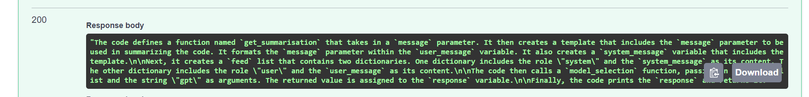

# Code Summarization llm

This project implements a FastAPI-based API for summarizing code using OpenAI's GPT-3.5-turbo model.

# 

## Create a .env file in the project root directory and add your OpenAI API key:

OPENAI_API_KEY=your-api-key-here

## Run the application:

uvicorn main:app --host 0.0.0.0 --port 8001 --reload

## License

This project is licensed under the MIT License.
 is this correct